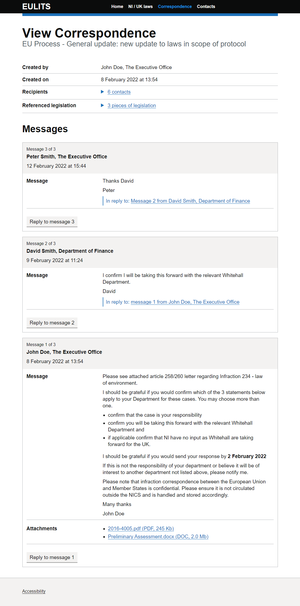

# NIGOV message list
**Version 1.0.0** 

> This component is currently experimental because more research is needed to validate it.

## When to use it
Use the message list component to show a conversation between the users of a case management system.

I have included a HTML example - `viewCorrespondence_example.html`, in this repository, of how the message list component should be used.

## Dependencies
Along with the styles set out in the stylesheet `css/nigov-message-list.css`, the message list component uses styles and components from the [GOV.UK design system](https://design-system.service.gov.uk/).

The message list component is compatible with GOV.UK frontend versions 3.14.0.

## Setup
Add the stylesheet `css/nigov-message-list.css` to your existing GOVUK frontend stylesheet.

